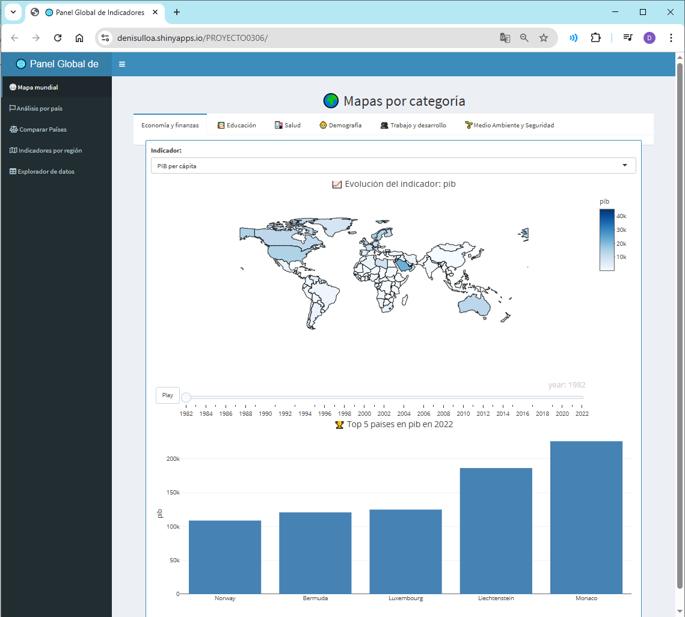
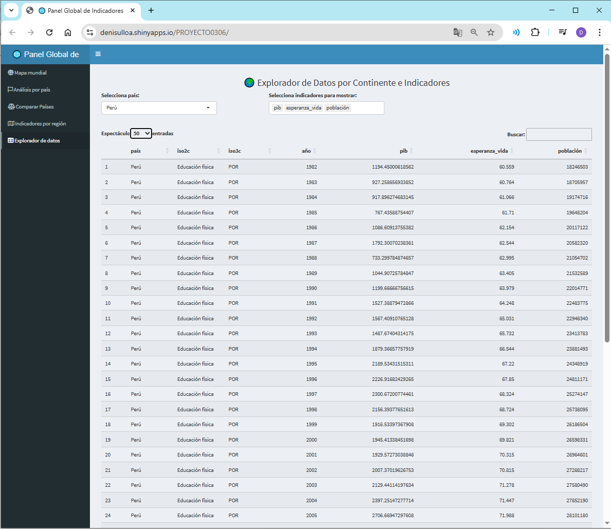

# 🌐 Visualización Interactiva de Indicadores Económicos y Sociales Globales con R Shin

[Ver demo en línea 🚀](https://denisulloa.shinyapps.io/PROYECTO0306/)

Este proyecto presenta un dashboard interactivo desarrollado en **R Shiny** que permite la exploración visual de más de 20 indicadores clave del desarrollo global, abarcando temas como economía, educación, salud, demografía, medio ambiente y empleo. La información visualizada proviene de dos fuentes reconocidas internacionalmente: **Gapminder** y el **Banco Mundial**, específicamente su base de datos oficial **World Development Indicators (WDI)**.

**Gapminder**, fundación sin fines de lucro creada por Hans Rosling, es ampliamente conocida por su enfoque educativo, el uso de animaciones interactivas y la capacidad de comunicar visualmente el desarrollo global con claridad. Sin embargo, Gapminder no siempre mantiene una actualización estrictamente alineada con los informes oficiales, ya que sus datos han sido preprocesados, interpolados o transformados para fines de visualización y comunicación.

Por esta razón, en este proyecto se optó por utilizar directamente la **API del Banco Mundial a través del paquete `WDI` en R**, que permite acceder a los datos originales, actualizados y reportados oficialmente por los gobiernos de cada país. Esta decisión garantiza:
- **Trazabilidad**: cada dato puede vincularse con su indicador y código oficial (ej. `NY.GDP.PCAP.CD` para PIB per cápita).
- **Actualización automática**: la API WDI se sincroniza con la última información disponible.
- **Rigor técnico y reproducibilidad**: los datos no han sido interpolados, estimados ni alterados.

No obstante, se mantuvo la **inspiración visual y estructural de Gapminder**, incorporando mapas animados por año, comparaciones entre países, gráficos de burbujas y un enfoque visual accesible. De esta manera, el dashboard combina la **solidez técnica del WDI** con la **claridad y el enfoque educativo de Gapminder**, ofreciendo una herramienta interactiva útil tanto para investigadores como para estudiantes, docentes, instituciones públicas y tomadores de decisiones.

- Datos del Banco Mundial (WDI): [https://data.worldbank.org/indicator](https://data.worldbank.org/indicator)
- Gapminder Tools: [https://tools.gapminder.org/](https://tools.gapminder.org/)
- Gapminder Dataset: [https://www.gapminder.org/data/](https://www.gapminder.org/data/)

## 🌐 Enlace al Proyecto en Producción

El dashboard puede ser accedido públicamente en:  
🔗 [https://denisulloa.shinyapps.io/PROYECTO0306/](https://denisulloa.shinyapps.io/PROYECTO0306/)

Desplegado con [ShinyApps.io](https://www.shinyapps.io/), permitiendo la visualización interactiva desde cualquier navegador sin necesidad de instalar R.

## 📸 Vista general

  

---

## 🎯 Objetivo del Proyecto

Construir una herramienta visual interactiva que facilite el análisis comparativo de países a través de indicadores oficiales del Banco Mundial, apoyando la toma de decisiones académicas, gubernamentales y empresariales.

---

## 🔎 Paneles del Dashboard

### 1. 🌍 **Mapa Mundial por Categorías**

Visualización geoespacial animada por año. Permite analizar:

- Economía (PIB, ingreso, inflación)
- Educación (escolaridad, alfabetización)
- Salud (esperanza de vida, mortalidad infantil)
- Demografía (población, natalidad, mortalidad)
- Trabajo y desarrollo (empleo, pobreza)
- Medio ambiente (bosques, gasto militar)

### 2. 📈**Análisis por País**

Permite filtrar por país y rango de años:

  

- Series temporales de cada indicador
- Comparación de natalidad vs mortalidad
- Relación PIB vs Esperanza de vida
- Comparación Pobreza vs Mortalidad

### 3. ⚖️ **Comparación entre Países**

  

- Compara dos países simultáneamente por indicador y año
- Selección por categoría temática

### 4. 🌎 **Indicadores por Región**

  

- Gráficos de burbujas por continente
- Tamaño proporcional a la población
- Relación entre variables como educación vs PIB, salud vs vida, etc.

### 5. 📥 **Explorador y Exportación de Datos**

  

- Filtro por país e indicadores
- Exportación directa a CSV

---

## 📈 Variables e Indicadores

Incluye más de **20 indicadores** provenientes del Banco Mundial, entre ellos:

| Categoría     | Indicadores principales                          |
|---------------|--------------------------------------------------|
| Economía      | PIB per cápita, ingreso nacional, inflación      |
| Educación     | Escolaridad promedio, gasto educativo, alfabetización |
| Salud         | Esperanza de vida, mortalidad infantil, vacunación |
| Demografía    | Población, natalidad, fertilidad, mortalidad     |
| Trabajo       | Desempleo, empleo total, pobreza extrema         |
| Medio Ambiente y seguridad | Superficie boscosa, gasto militar                |

---

## 🧹 Limpieza y Procesamiento de Datos

- Se usó el paquete `WDI` para extraer datos directamente desde la API del Banco Mundial.
- Se filtraron años nulos y países sin código ISO3.
- Se asignaron continentes con `countrycode`.
- Se renombran columnas con nombres legibles para el usuario.
- La base de datos se mantiene actualizable y reproducible.

---

## 📚 Tecnología Usada

- **Lenguaje:** R 4.2+
- **Paquetes clave:** `shiny`, `plotly`, `WDI`, `shinydashboard`, `DT`, `dplyr`, `tidyr`, `countrycode`
- **Base de datos:** Banco Mundial - World Development Indicators (API oficial)

---

## ✅ Bondades del Proyecto

- 🔄 Conexión automática con la base del Banco Mundial actualizada.
- 📊 Exploración comparativa, por país, por región y multivariable.
- 📤 Exportación de datos filtrados para su uso académico o gubernamental.
- 💻 Código reproducible y escalable.
- 🧠 Ideal para docencia, investigación y análisis de políticas públicas.

## ⚠️ Limitaciones

- Algunos indicadores presentan series discontinuas.
- No todos los países tienen datos disponibles para todos los años.
- No se han realizado imputaciones ni predicciones.

---

## 👥 Colaboradores

- **SARAYA VILLAR, Miguel Saraya**  
  [🔗 github.com/MiguelSaraya](https://github.com/MiguelSaraya)
  
- **ULLOA DE LA CRUZ, Denis Yanin**  
  [🔗 github.com/DeniseUlloa](https://github.com/DeniseUlloa)

- **VILCA SANGAY, Jesús Oma**  
  [🔗 github.com/vilcas](https://github.com/vilcas)

- **YAULI MINA, Juan Admeht**  
  [🔗 github.com/ADMEHT](https://github.com/ADMEHT)
 

---

## 📝 Licencia

MIT License

## 📁 Repositorio del Proyecto

🔗 [https://github.com/DeniseUlloa/dashboard-wdi-indicadores-globales](https://github.com/DeniseUlloa/dashboard-wdi-indicadores-globales)

---

## 📚 Referencias Bibliográficas

- Banco Mundial. (2023). *World Development Indicators (WDI)*. Retrieved from [https://data.worldbank.org/indicator](https://data.worldbank.org/indicator)

- Gapminder Foundation. (2023). *Gapminder Tools & Data*. Retrieved from [https://www.gapminder.org/data/](https://www.gapminder.org/data/)

- Wickham, H., & Grolemund, G. (2017). *R for Data Science: Import, Tidy, Transform, Visualize, and Model Data*. O’Reilly Media. [https://r4ds.had.co.nz](https://r4ds.had.co.nz)

- Chang, W. (2021). *Shiny: Web Application Framework for R*. R package version 1.7.1. [https://shiny.rstudio.com](https://shiny.rstudio.com)

- Sievert, C. (2020). *Interactive Web-Based Data Visualization with R, plotly, and shiny*. Chapman and Hall/CRC. [https://plotly-r.com](https://plotly-r.com)

- R Core Team. (2023). *R: A Language and Environment for Statistical Computing*. R Foundation for Statistical Computing. [https://www.R-project.org/](https://www.R-project.org/)
