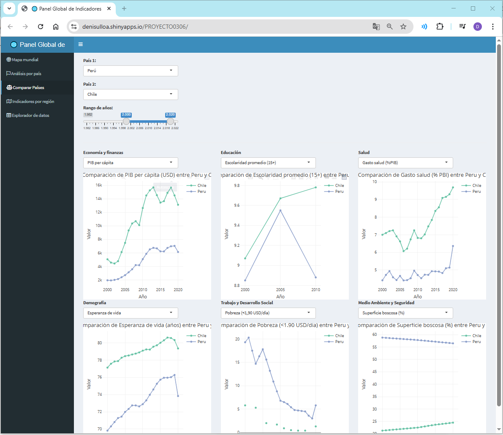
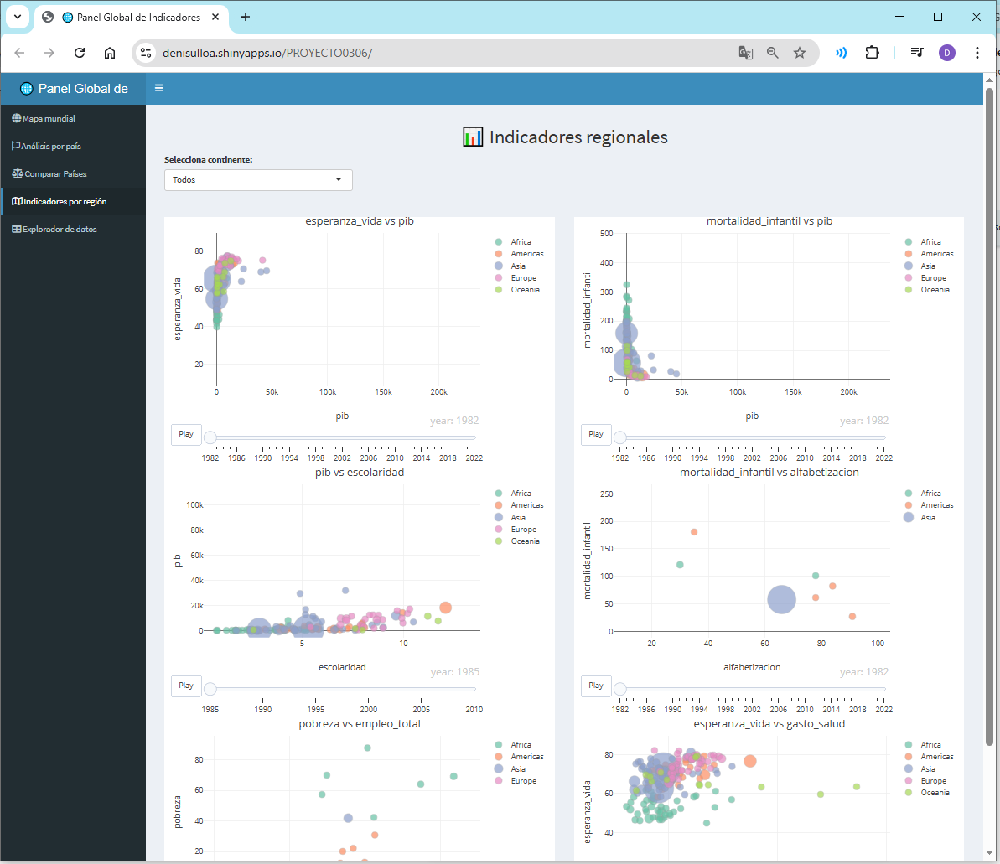

```{r setup, include=FALSE}
knitr::opts_chunk$set(echo = TRUE)
```

## Presentación

Este informe presenta el desarrollo e implementación de un tablero interactivo en R Shiny, basado en los indicadores del desarrollo económico y social proporcionados por el Banco Mundial (WDI), complementado con criterios visuales de Gapminder.

El trabajo se enmarca dentro del curso de Herramientas Informáticas de la Maestría en Economía con mención en Data Analytics , y busca fortalecer la capacidad de análisis visual interactivo para la toma de decisiones fundamentadas en evidencia empírica.


## 🎯 Objetivo

Diseñar e implementar un tablero interactivo que permita explorar indicadores clave del desarrollo global, facilitando comparaciones entre países, regiones y años, utilizando datos oficiales del Banco Mundial.


## 🧪 Metodología

Idioma y entorno: R (versión 4.2+) y RStudio.
Estructura: Shiny
Datos: Descargados vía API con el paquete WDI.
Visualización: Utilizando plotly, shinydashboard, y DT.

## 🔧 Limpieza y procesamiento

Eliminación de valores faltantes ( NA).
Estandarización de nombres de variables.
Asignación de continentes con el paquete countrycode.
Transformaciones con dplyry tidyr.

## Repositorio: 
https://github.com/DeniseUlloa/dashboard-wdi-indicadores-globales

## Dashboard: 

https://denisulloa.shinyapps.io/PROYECTO0306/


\newpage

## Base de datos

Los datos provienen principalmente de:

📘 Banco Mundial – Indicadores de Desarrollo Mundial (WDI): https://data.worldbank.org/indicator

📘 Gapminder: https://www.gapminder.org/data/

Se priorizó la base de datos WDI por su actualización oficial, mayor trazabilidad y posibilidad de automatizar la extracción con el paquete WDI.


## 🌟 Bondades del Proyecto
Acceso a datos actualizados vía API.
Visualización dinámica por año y categoría.
Exportación directa de tablas filtradas.
Reproducibilidad completa del análisis.

## ⚠️ Limitaciones
Algunos indicadores tienen valores faltantes en países específicos.
No se aplicarán imputaciones ni modelos predictivos.

## 📊  Indicadores y Categorías 
Los principales indicadores utilizados incluyen:

- Economía	(PIB per cápita, ingreso nacional, inflación)	
- Educación	(Escolaridad promedio, alfabetización	años)
- Salud	(Esperanza de vida, mortalidad infantil)
- Demografía	(Población total, natalidad, mortalidad	personas)
- Trabajo	(Empleo total, desempleo, pobreza extrema)
- Medio ambiente y seguridad	(Superficie boscosa, gasto militar)

\newpage

## 📦 Código Completo del Proyecto Shiny

```{r shiny_app, eval=FALSE}
shinyApp(ui, server)

# Librerías
library(shiny)
library(dplyr)
library(WDI)
library(plotly)
library(countrycode)
library(shinydashboard)
library(DT)
library(tidyr)
library(rlang)

# Carga de datos
indicadores <- c("pib", "esperanza_vida", "poblacion", "gasto_educacion", "ingreso", "pib_total",
                 "ingreso_nacional_bruto", "inflacion", "escolaridad", "alfabetizacion", "matricula_primaria",
                 "gasto_salud", "mortalidad_infantil", "vacunacion_dpt", "fertilidad", "natalidad",
                 "mortalidad", "pobreza", "desempleo", "empleo_total", "bosques", "gasto_militar")

# Mapeo de códigos del Banco Mundial
indicadores_wdi <- c(
  pib = "NY.GDP.PCAP.CD", ingreso = "NY.GNP.PCAP.CD", pib_total = "NY.GDP.MKTP.CD",
  ingreso_nacional_bruto = "NY.GNP.MKTP.CD", inflacion = "FP.CPI.TOTL.ZG", escolaridad = "BAR.SCHL.15UP",
  gasto_educacion = "SE.XPD.TOTL.GD.ZS", alfabetizacion = "SE.ADT.LITR.ZS", matricula_primaria = "SE.PRM.NENR",
  gasto_salud = "SH.XPD.CHEX.GD.ZS", mortalidad_infantil = "SH.DYN.MORT", vacunacion_dpt = "SH.IMM.IDPT",
  esperanza_vida = "SP.DYN.LE00.IN", fertilidad = "SP.DYN.TFRT.IN", natalidad = "SP.DYN.CBRT.IN",
  mortalidad = "SP.DYN.CDRT.IN", poblacion = "SP.POP.TOTL", pobreza = "SI.POV.DDAY",
  desempleo = "SL.UEM.TOTL.ZS", empleo_total = "SL.EMP.TOTL.SP.ZS", bosques = "AG.LND.FRST.ZS",
  gasto_militar = "MS.MIL.XPND.GD.ZS"
)

# Descarga y preparación
wdi_data <- WDI(country = "all", indicator = indicadores_wdi, start = 1982, end = 2022)
wdi_data$continente <- countrycode(wdi_data$iso3c, origin = "iso3c", destination = "continent")
wdi_data <- wdi_data %>% filter(!is.na(continente), !is.na(year))
names(wdi_data) <- gsub(".*\\.", "", names(wdi_data))

# Diccionario para mostrar nombres legibles
titulos_legibles <- list(
  pib = "PIB per cápita (USD)", ingreso = "Ingreso per cápita (USD)", pib_total = "PIB total (USD)",
  ingreso_nacional_bruto = "Ingreso nacional bruto (USD)", inflacion = "Inflación (%)",
  escolaridad = "Escolaridad (años)", gasto_educacion = "Gasto en educación (% PBI)",
  alfabetizacion = "Alfabetización (%)", matricula_primaria = "Matrícula primaria (%)",
  gasto_salud = "Gasto en salud (% PBI)", mortalidad_infantil = "Mortalidad infantil (por mil)",
  vacunacion_dpt = "Vacunación DPT (%)", esperanza_vida = "Esperanza de vida (años)",
  fertilidad = "Tasa de fertilidad", natalidad = "Natalidad (por mil)", mortalidad = "Mortalidad (por mil)",
  poblacion = "Población total", pobreza = "Pobreza extrema (%)", desempleo = "Desempleo (%)",
  empleo_total = "Empleo total (%)", bosques = "Superficie boscosa (%)", gasto_militar = "Gasto militar (% PBI)"
)

# UI del dashboard
ui <- dashboardPage(
  dashboardHeader(title = "Indicadores Globales"),
  dashboardSidebar(
    sidebarMenu(
      menuItem("Mapa Mundial", tabName = "mapa", icon = icon("globe")),
      menuItem("Comparar Países", tabName = "comparar", icon = icon("balance-scale")),
      menuItem("Top Rankings", tabName = "ranking", icon = icon("bar-chart"))
    )
  ),
  dashboardBody(
    tabItems(
      tabItem(tabName = "mapa",
              selectInput("indicador", "Seleccione un indicador:", choices = indicadores),
              sliderInput("anio", "Seleccione un año:", min = 1982, max = 2022, value = 2020, sep = ""),
              plotlyOutput("mapa_plot")
      ),
      tabItem(tabName = "comparar",
              selectInput("indicador_x", "Indicador Eje X:", choices = indicadores),
              selectInput("indicador_y", "Indicador Eje Y:", choices = indicadores),
              sliderInput("anio2", "Año:", min = 1982, max = 2022, value = 2020, sep = ""),
              plotlyOutput("scatter_plot")
      ),
      tabItem(tabName = "ranking",
              selectInput("indicador_rank", "Indicador a ordenar:", choices = indicadores),
              sliderInput("anio3", "Año:", min = 1982, max = 2022, value = 2020, sep = ""),
              plotlyOutput("ranking_plot")
      )
    )
  )
)

# Server del dashboard
server <- function(input, output) {

  output$mapa_plot <- renderPlotly({
    df <- wdi_data %>% filter(year == input$anio)
    plot_ly(df, type = "choropleth", locations = ~iso2c,
            z = ~get(input$indicador), text = ~country,
            colorscale = "Blues") %>%
      layout(title = titulos_legibles[[input$indicador]])
  })

  output$scatter_plot <- renderPlotly({
    df <- wdi_data %>% filter(year == input$anio2)
    plot_ly(df, x = ~get(input$indicador_x), y = ~get(input$indicador_y),
            text = ~country, color = ~continente, size = ~poblacion,
            type = "scatter", mode = "markers") %>%
      layout(title = paste(titulos_legibles[[input$indicador_y]], "vs", titulos_legibles[[input$indicador_x]]),
             xaxis = list(title = titulos_legibles[[input$indicador_x]]),
             yaxis = list(title = titulos_legibles[[input$indicador_y]]))
  })

  output$ranking_plot <- renderPlotly({
    df <- wdi_data %>% filter(year == input$anio3) %>%
      arrange(desc(get(input$indicador_rank))) %>% head(15)
    plot_ly(df, x = ~get(input$indicador_rank), y = ~reorder(country, get(input$indicador_rank)),
            type = "bar", orientation = "h") %>%
      layout(title = paste("Top 15 países en", titulos_legibles[[input$indicador_rank]]),
             xaxis = list(title = titulos_legibles[[input$indicador_rank]]),
             yaxis = list(title = "País"))
  })
}

# Ejecutar app
shinyApp(ui, server)
```

\newpage

## 🌐 Enlace al Proyecto en Producción
 https://denisulloa.shinyapps.io/PROYECTO0306/

## 🗺️  Panel 1: Mapa Mundial por Categorías
Este panel permite visualizar mapas geoespaciales animados por año, agrupando los indicadores por categorías como economía, salud, educación, demografía, trabajo y medio ambiente.


```{r img_portada, echo=FALSE}
knitr::include_graphics("img/Portada.png")
```


```{r load_libraries, include=FALSE}
library(dplyr)
library(plotly)
library(WDI)
library(countrycode)
```


```{r cargar_datos, message=FALSE, warning=FALSE}
library(WDI)
library(dplyr)
library(countrycode)

# Descargar datos desde WDI
datos <- WDI(
  country = "all",
  indicator = c("NY.GDP.PCAP.CD"),
  start = 2022,
  end = 2022
)

# Asignar continentes y limpiar datos
datos <- datos %>%
  mutate(continente = countrycode(iso3c, origin = "iso3c", destination = "continent")) %>%
  filter(!is.na(NY.GDP.PCAP.CD), !is.na(iso3c))
```

\newpage

### 🔹 Código de un mapa representativo

```{r mapa_mundial_pib, echo=TRUE, eval=TRUE, warning=FALSE, message=FALSE}
datos_2022 <- datos %>%
  filter(year == 2022, !is.na(NY.GDP.PCAP.CD))

plot_geo(datos_2022) %>%
  add_trace(
    z = ~NY.GDP.PCAP.CD,
    color = ~NY.GDP.PCAP.CD,
    colors = "Blues",
    text = ~paste(country, "<br>PIB per cápita:", round(NY.GDP.PCAP.CD, 2)),
    locations = ~iso3c,
    locationmode = "ISO-3",
    colorbar = list(title = "PIB per cápita (USD)")
  ) %>%
  layout(
    title = "📍 Mapa de PIB per cápita - Año 2022",
    geo = list(showframe = FALSE, showcoastlines = FALSE)
  )

```

\newpage

## 📈 2. Análisis por país
Este panel permite filtrar por país y rango de años , mostrando:
Serie de tiempo de cada indicador.
Comparación natalidad vs mortalidad.
Relación entre PIB y esperanza de vida.
Relación entre pobreza extrema y mortalidad.


```{r img_analisis_pais, echo=FALSE}
knitr::include_graphics("img/Analisis paises.png")
```
\newpage

## ⚖️ 3. Comparación entre Países
Compara dos países seleccionados por el usuario, visualizando gráficos por:

- Economía
- Educación
- Salud
- Demografía
- Trabajo y seguridad
- Medio ambiente


```{r img_comparar_paises, echo=FALSE}

```
\newpage

## 🌎 4. Indicadores por Región
Visualización de gráficos de burbujas animadas , donde cada burbuja representa un país y el tamaño es proporcional a la población. Permite explorar correlaciones:

- PIB vs esperanza de vida
- Escolaridad vs PIB
- Alfabetización vs mortalidad infantil
- Desempleo vs pobreza
- Gasto en salud vs esperanza de vida


```{r img_region_burbujas, echo=FALSE}

```

\newpage

## 📊 5. Explorador de datos
Este panel permite:

- Seleccione un país y múltiples indicadores.
- Visualizar datos tabulados.
- Descargar el conjunto de datos filtrado en .csv.

```{r img_exportar_tabla, echo=FALSE}
knitr::include_graphics("img/Exportar.PNG")
```

\newpage

## 📁 Repositorio del Proyecto
🔗 https://github.com/DeniseUlloa/dashboard-wdi-indicadores-globales


## 📚 Referencias Bibliográficas

- Banco Mundial. (2024). *World Development Indicators (WDI)*. Recuperado de [https://data.worldbank.org/indicator](https://data.worldbank.org/indicator)

- Gapminder Foundation. (2023). *Gapminder Tools & Data*. Recuperado de [https://www.gapminder.org/data/](https://www.gapminder.org/data/)

- Chang, W. (2021). *Shiny: Web Application Framework for R*. RStudio. Disponible en [https://shiny.rstudio.com](https://shiny.rstudio.com)

- Wickham, H., & Grolemund, G. (2017). *R for Data Science*. O’Reilly Media. [https://r4ds.had.co.nz](https://r4ds.had.co.nz)

- Sievert, C. (2020). *Interactive Web-Based Data Visualization with R, plotly, and shiny*. Chapman and Hall/CRC. [https://plotly-r.com](https://plotly-r.com)

- R Core Team. (2024). *R: A Language and Environment for Statistical Computing*. R Foundation for Statistical Computing. [https://www.r-project.org/](https://www.r-project.org/)

- World Bank API (2024). *WDI R Package API documentation*. [https://github.com/vincentarelbundock/WDI](https://github.com/vincentarelbundock/WDI)


